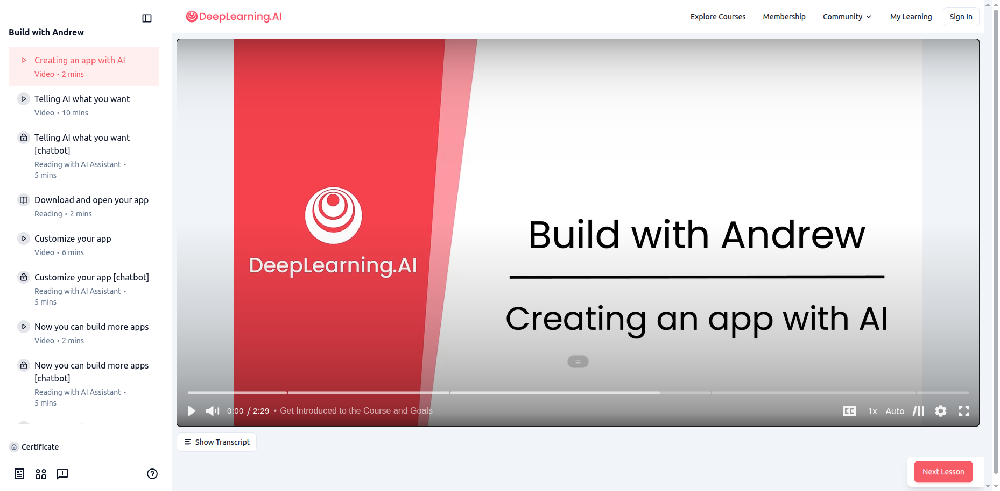
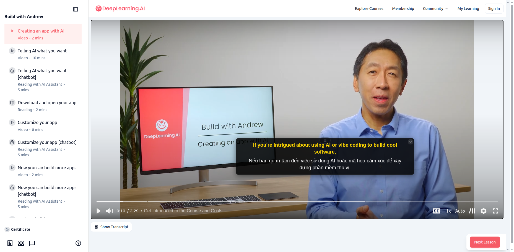

# 🎬 Dual Subtitles for DeepLearning.AI

Chrome extension that displays bilingual subtitles (English + Vietnamese) for DeepLearning.AI courses. Automatically translates English subtitles to Vietnamese in real-time!

 

## ✨ Features

- 🌍 **Bilingual Subtitles** - Display English and Vietnamese subtitles simultaneously
- ⚡ **Fast Translation** - Parallel batch translation for quick results
- 🖱️ **Draggable** - Move subtitle box anywhere on the screen
- 🔄 **Auto-Sync** - Automatically syncs with video playback
- 💾 **Smart Caching** - Remembers translations for repeated viewing
- 📱 **Mobile Support** - Works on touch devices
- 🎯 **Easy to Use** - Just install and play!

## 📸 Screenshots

| Default View | After Dragging |
|--------------|----------------|
|  |  |

## 🚀 Installation

### Method 1: Load Unpacked (Development)

1. Download or clone this repository:
```bash
git clone https://github.com/YOUR_USERNAME/dual-subtitles-deeplearning.git
cd dual-subtitles-deeplearning
```

2. Open Google Chrome and navigate to `chrome://extensions/`

3. Enable **Developer mode** (toggle in top right corner)

4. Click **Load unpacked** and select the `dual-subtitles-deeplearning` folder

5. The extension is now installed!

### Method 2: Chrome Web Store (Coming Soon)

Will be available on the Chrome Web Store for easy installation.

## 📖 Usage

1. **Open a DeepLearning.AI course** with video lessons
   - Go to: https://learn.deeplearning.ai/
   - Navigate to any course lesson with video

2. **The extension activates automatically**
   - Look for the drag handle `≡` at the bottom center of the video
   - Subtitles will appear when the video plays

3. **Move the subtitles** (optional)
   - Click and drag the `≡` handle to reposition
   - Or click anywhere on the subtitle box to drag
   - Reset to original position by clicking `↺` button

4. **Enable video subtitles**
   - Make sure to enable the CC/Subtitles button on the video player
   - The extension needs the original English subtitles to work

## 🎯 How It Works

```
┌─────────────────────────────────────────────────────────┐
│  DeepLearning.AI Video Player                          │
│                                                         │
│  ┌─────────────────────────────────────────────────┐   │
│  │  Video Content                                  │   │
│  └─────────────────────────────────────────────────┘   │
│                                                         │
│  ┌──────────────────────────────────────────────┐     │
│  │  If you're intrigued about using AI...       │     │  ← English (Yellow)
│  │  Nếu bạn quan tâm đến việc sử dụng AI...      │     │  ← Vietnamese (White)
│  └──────────────────────────────────────────────┘     │
│                      ≡                               │  ← Drag Handle
└─────────────────────────────────────────────────────────┘
```

### Technical Details

1. **Fetch VTT File** - Downloads the WebVTT subtitle file from the video server
2. **Parse Subtitles** - Extracts all subtitle entries with timestamps
3. **Parallel Translation** - Translates multiple subtitles simultaneously using Google Translate API
4. **Video Sync** - Monitors video playback time and displays matching subtitles
5. **Overlay Display** - Shows bilingual subtitles in a draggable overlay

## 🔧 Configuration

You can customize the extension by editing `js/content.js`:

```javascript
const CONFIG = {
  overlayBackground: 'rgba(0, 0, 0, 0.85)',  // Background color
  originalColor: '#ffd700',                 // English text color (gold)
  translatedColor: '#ffffff',              // Vietnamese text color (white)
  fontSize: '18px',                        // Font size
  batchSize: 5,                            // Parallel translations
  preTranslateCount: 50,                   // Number of subtitles to pre-translate
  debug: true                              // Enable console logging
};
```

## 🌐 Supported Websites

Currently supports:
- ✅ **DeepLearning.AI** - https://learn.deeplearning.ai/*
- ✅ **Coursera** - https://www.coursera.org/*

## 🐛 Troubleshooting

### Subtitles not appearing?

1. Make sure **CC/Subtitles** are enabled on the video player
2. Check if the video has English subtitles available
3. Open Console (F12) and check for error messages

### Translation is slow?

- The extension pre-translates the first 50 subtitles
- Translations are cached, so repeated viewings are instant
- Wait 10-20 seconds after opening the video for best results

### Can't drag the subtitles?

- Click on the `≡` drag handle at the bottom of the video
- Make sure you're not clicking on the reset button `↺`
- Try refreshing the page if it doesn't work

## 📝 Development

### Prerequisites

- Google Chrome browser
- Basic knowledge of JavaScript and Chrome extensions

### Building from Source

1. Clone the repository
2. Modify files in `js/` directory
3. Load unpacked in Chrome for testing
4. Test changes and create pull request

### Project Structure

```
dual-subtitles-deeplearning/
├── manifest.json          # Extension configuration
├── README.md              # This file
├── LICENSE                # MIT License
├── js/
│   ├── content.js         # Main content script
│   └── background.js      # Background service worker
├── icon64.png            # Extension icon (64x64)
└── icon128.png           # Extension icon (128x128)
```

## 🤝 Contributing

Contributions are welcome! Please feel free to submit a Pull Request.

1. Fork the repository
2. Create your feature branch (`git checkout -b feature/AmazingFeature`)
3. Commit your changes (`git commit -m 'Add some AmazingFeature'`)
4. Push to the branch (`git push origin feature/AmazingFeature`)
5. Open a Pull Request

## 📄 License

This project is licensed under the MIT License - see the [LICENSE](LICENSE) file for details.

## 🙏 Acknowledgments

- Google Translate API for translation service
- DeepLearning.AI for providing excellent AI courses
- Original inspiration from [coursera-dual-subtitles](https://github.com/nullcoke/coursera-dual-subtitles)

## 📧 Support

If you find any issues or have suggestions, please:
- Open an issue on GitHub
- Contact: [vongocminh0609@example.com]

## 🌟 Star this repo!

If you find this extension helpful, please consider giving it a star! ⭐

---

**Made with ❤️ for Vietnamese learners**
